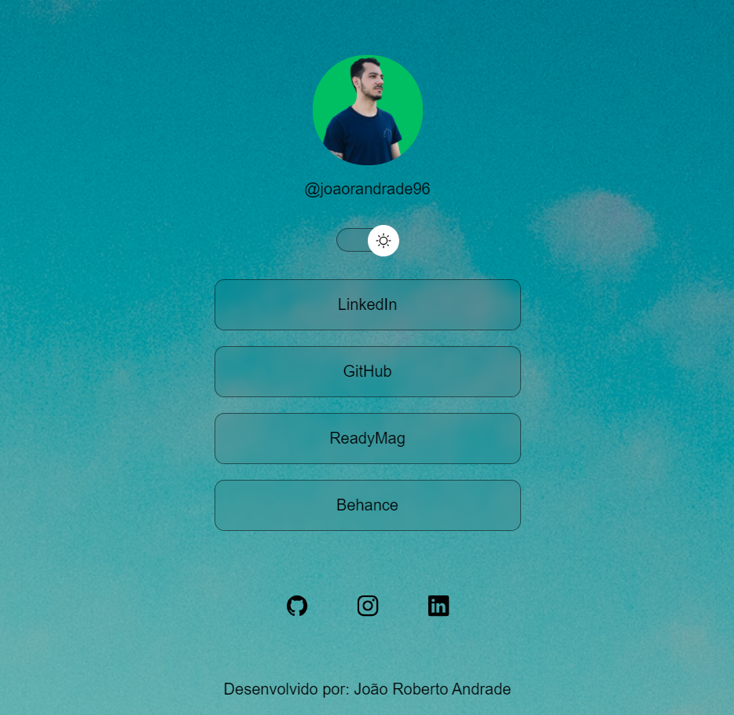

#discover-rocketseat
<h1 align="center">#Projeto Discover Rocket Seat</h1>

<h2>##Este repositório se trata do meu primeiro projeto de programação, efetuado durante o curso Discover, da Rocket Seat.</h2>

<h3>###O projeto em questão se trata de um aglutinador de links, com o objetivo de agrupar os links de portfólios e redes sociais.</h3>
<h3>Linguagens utilizadas:</h3>
<ul>
  <li>HTML,</li>
  <li>CSS e </li>
  <li>JavaScript.</li>
</ul>

